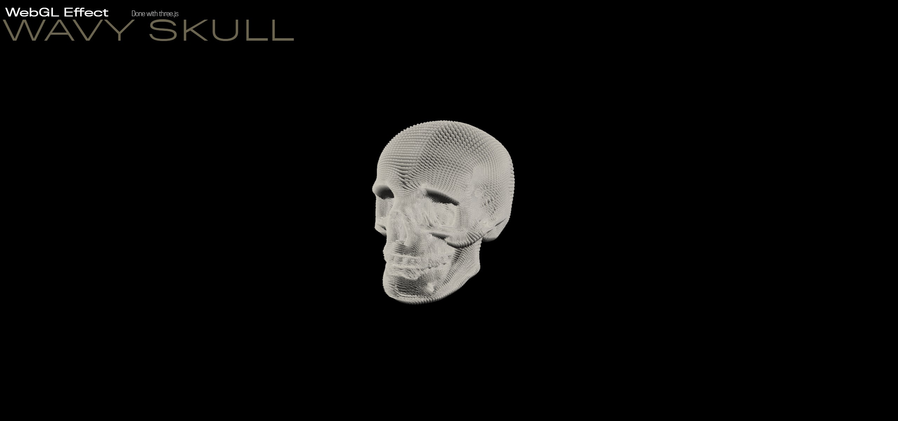

# Wavy skull

Three.js experiment with custom shader to render wavy fur like.

## Description

This project show how to setup an advanced particle system using [three.js](https://threejs.org/).

Press space to make skull jumping.

You can control the camera using mouse. 

## Youtube video

Check the [video](https://youtu.be/EAwcrENkD1I) on youtube.